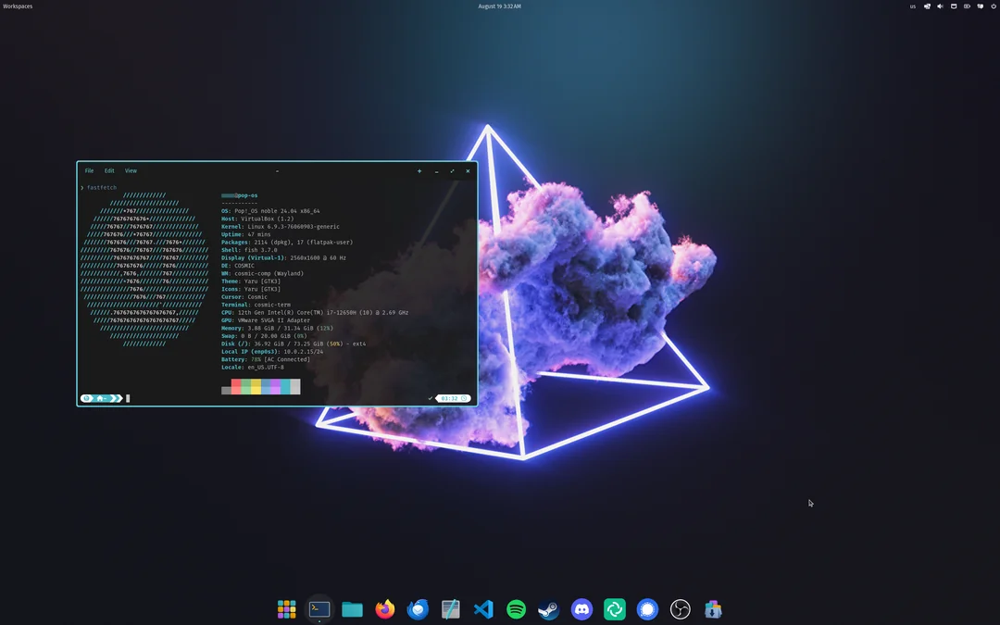

# popOS

###### *[popOS with cosmic](https://system76.com/cosmic) and [Starship](https://starship.rs/)*

- www.tecmint.com/things-do-after-installing-pop_os-linux/
  
- www.averagelinuxuser.com/pop-os-after-install/
  

# Arch
## typecraft tutoriais:
- [Installing Arch Linux -- Linux for Newbs EP 1](https://youtu.be/8YE1LlTxfMQ)
  
- [Tiling Window Manager? Linux For Newbs EP 2](https://youtu.be/xWIDvnNFl5I)
  
- [tutorial de timeshift com BTRFS](https://youtu.be/V1wxgWU0j0E) (que nao funciona)
    
  - [ativar backup com BTRFS](https://www.youtube.com/watch?v=TFhoBYakkY4) (funciona)
    

- firefox
- chrome
- alacritty com caputin e nerdfonts
- nvim
- vscode
- neofetch
- yay
- timeshift
- gnome extension [hide top bar](https://extensions.gnome.org/extension/545/hide-top-bar/) / dash to dock / open bar / fuzzy-search
- [locales do brasil](https://wiki.archlinux.org/title/Locale) caso tenha esquecido de configurar no archinstall script
- [alt tab em instâncias](https://superuser.com/questions/394376/how-to-prevent-gnome-shells-alttab-from-grouping-windows-from-similar-apps)(acho que nem precisa disso na real, quase certeza que tem nas configurações normais do gnome. já adiciona o shortcut super+t pra teminal tbm
- [pop shell & launcher](https://diolinux.com.br/sistemas-operacionais/opensuse/pop-shell-outras-distros.html) / [cosmic](https://system76.com/cosmic) e alternativas [1](https://askubuntu.com/questions/1351357/is-there-a-way-to-install-just-the-pop-launcher-in-ubuntu) / [2](https://plus.diolinux.com.br/t/talvez-agora-voce-tenha-bons-motivos-para-usar-o-pop-launcher-tambem/37979)
- [filosofia do gnome](https://www.youtube.com/watch?v=5jzN0_UXNII)

# code env

  ## setup
  [i3wm config | Linux for Newbs EP 3](https://youtu.be/wXZgUudR41I)
    
  [kitty > allacritty](https://youtu.be/BeSUAEZIf9A)
    
  www.starship.rs
    
  www.github.com/sharkdp/bat
    
  
  ## save
  [NEVER lose dotfiles again with GNU Stow](https://youtu.be/NoFiYOqnC4o)

